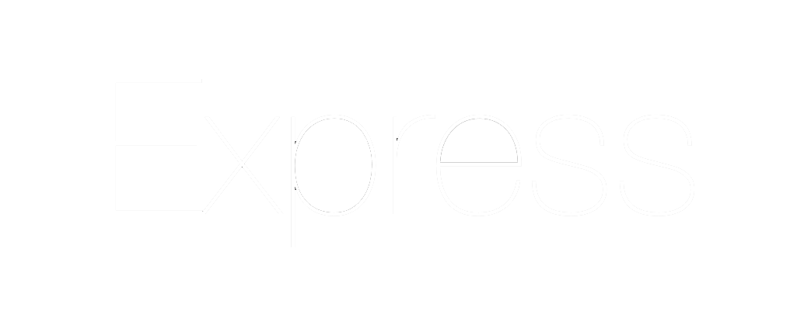
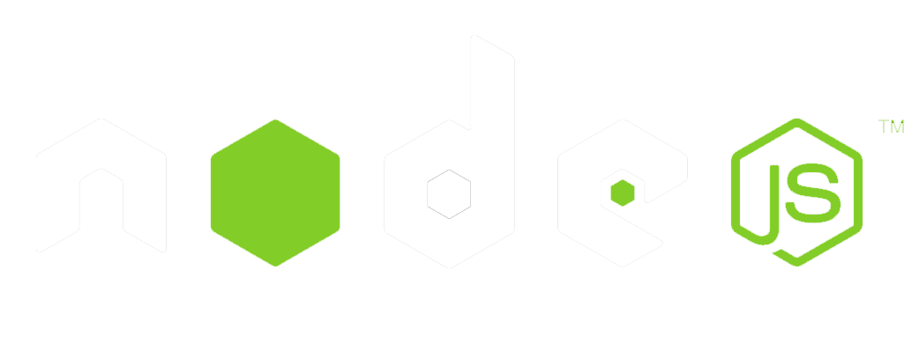

 

    
     
   
  
     
      
     
  
    

  
   
  
   
  
    
    
     
      

 
 

  

 

                                    - 🔭 I’m constanly working on new projects

                                    - 👯 I’m looking to collaborate on anything that i can learn from!

                                    - 👨‍💻 All my finished projects are available at <a href="www.luciabelen.dev" target="_blanck" rel="noreferrer">luciabelen.dev</a>

   

<h3 align="center">🌱 Currently learning:</h3>

 

    
   
   
   <a href="https://nodejs.org/en" target="_blank" rel="noreferrer"> 
        
 

     

     <b><h3 align="center">Connect with me:</h3></b>

      
 

     
     
 

      
       

|  |  |

